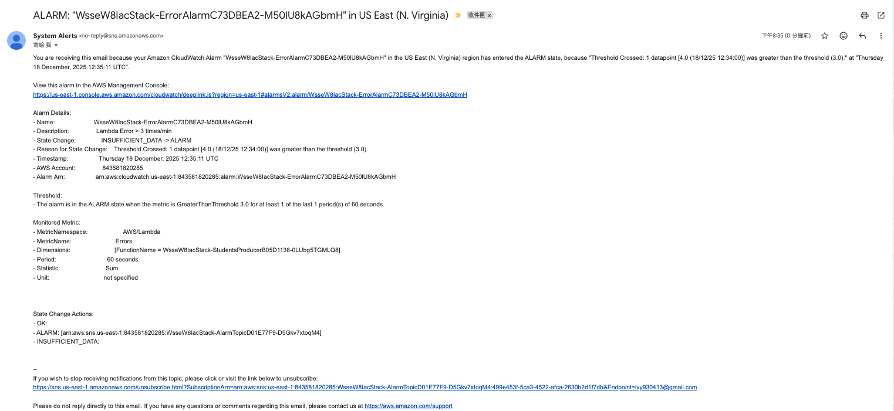
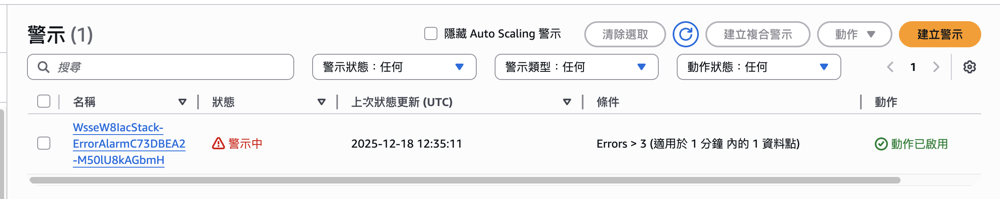
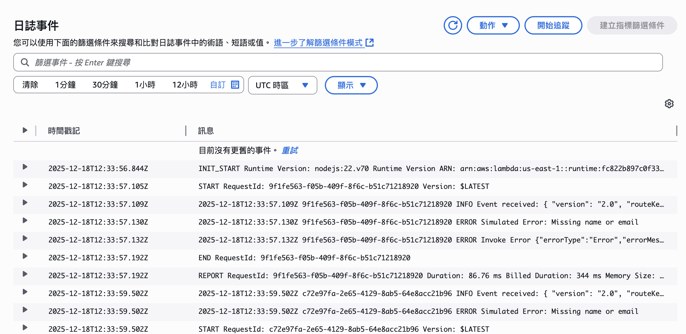
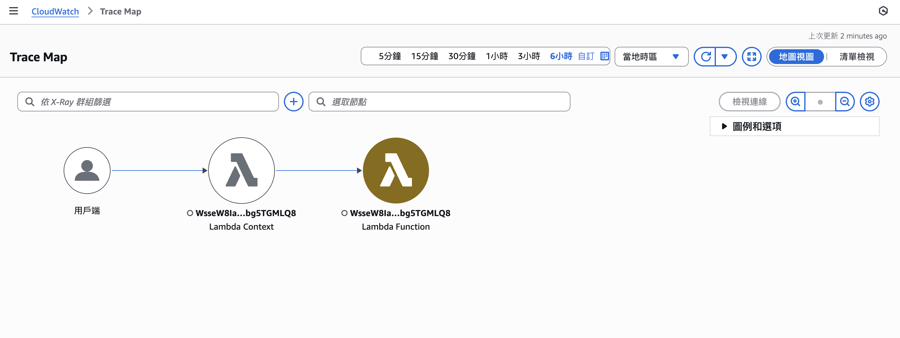

# Lab-07 監控與告警整合 (Monitoring & Observability)
411177001 呂依涵

## 1. 實驗目的
本實驗旨在透過 AWS CDK 將可觀測性（Observability）工具整合至 Serverless 架構中。
實作項目包含：
1. **Logs**：設定 Lambda Log 保存期限，避免成本浪費。
2. **Metrics & Alarms**：定義錯誤指標，並設定當錯誤超過門檻時觸發 SNS Email 通知。
3. **Dashboard**：建立視覺化儀表板，即時監控系統健康狀況。
4. **X-Ray**：啟用分散式追蹤，觀察請求在服務間的流向與延遲。

---

## 2. 驗證截圖

以下截圖證明系統監控與告警功能運作正常。
驗證截圖均存放在：

#### (1) CloudWatch Alarm 狀態
說明：CloudWatch Alarm 偵測到錯誤次數超過門檻 (Threshold > 3)，狀態轉為紅色的 **In Alarm**。

#### (2) SNS Email 通知
說明：Alarm 觸發後，AWS SNS 自動發送告警信件至我的信箱。

#### (3) CloudWatch Dashboard
說明：透過 CDK 部署的儀表板，顯示 Lambda Errors 與 Duration 的折線圖，可見錯誤次數飆升。

#### (4) CloudWatch Logs
說明：在 Log groups 中查閱詳細錯誤訊息，顯示 "Invalid input: missing name or email"。

#### (5) X-Ray Service Map
說明：啟用 X-Ray Tracing 後，可看見 Client -> Lambda 的呼叫鏈路，且 Lambda 節點呈現黃色/橘色（代表有錯誤發生）。

